# 🧱 Arkanoid (C++ & SFML)

  
  
  
  

---

## 🎮 Overview

A **classic Arkanoid/Breakout clone** built using **C++17** and **SFML**.  
Control the paddle, bounce the ball, and break all the bricks to win!

✨ Current Features Implemented:

- ✅ Paddle movement (smooth left & right)
- ✅ Ball physics (bouncing, velocity control)
- ✅ Paddle–ball collision with realistic angle reflection
- ✅ Wall & bottom collision detection
- ✅ Lives system (ball reset when lost, game over when lives = 0)
- ✅ Restart system (press `R` to reset game state)
- ✅ Score system (points for breaking bricks)

🚧 Planned Features:

- Multiple levels with increasing difficulty
- Power-ups (expand paddle, extra balls, etc.)
- Retro-inspired visuals & sound effects

---

## 📸 Screenshots

  🚧 Coming Soon 🚧  

---

## 🛠️ Tech Stack

- **Language:** C++17
- **Library:** [SFML](https://www.sfml-dev.org/)
- **IDE:** Visual Studio / CLion

---

## 🔄 Game Flow

```mermaid
flowchart TD
    A[Start Game] --> B[Initialize Window, Paddle, Ball, Bricks]
    B --> C[Game Loop]

    C -->|Handle Input| D[Paddle Movement]
    C -->|Update| E[Ball Movement & Physics]
    C -->|Update| F[Collision Detection]
    F --> F1[Ball ↔ Walls]
    F --> F2[Ball ↔ Paddle]
    F --> F3[Ball ↔ Bricks → Score++]

    C -->|Check State| G{Lives > 0?}
    G -->|Yes| C
    G -->|No| H[Game Over Screen]

    H -->|Press R| A
```

